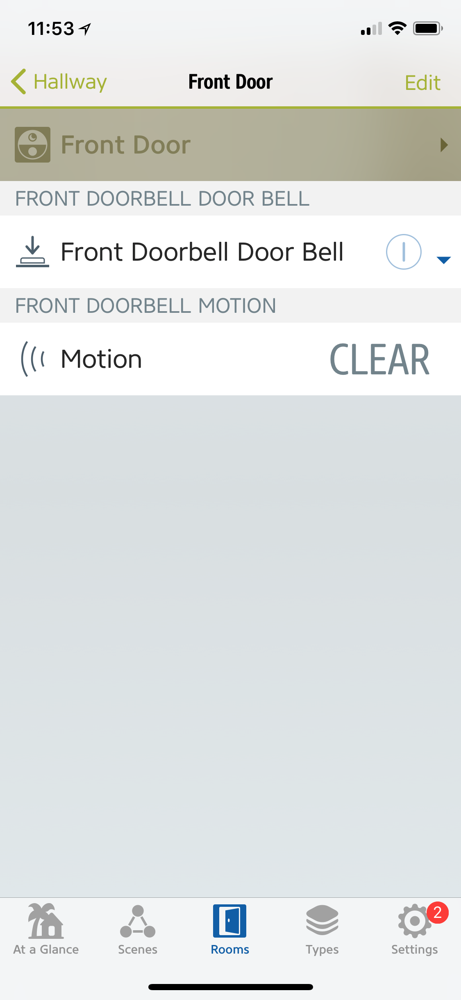
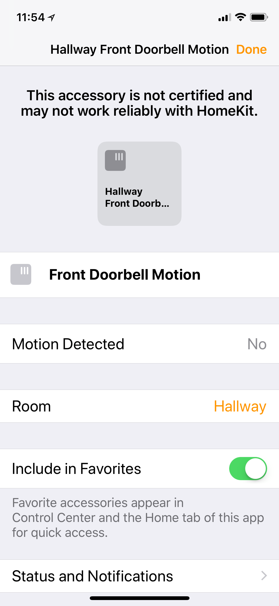
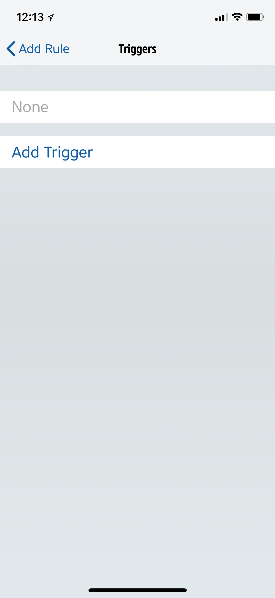
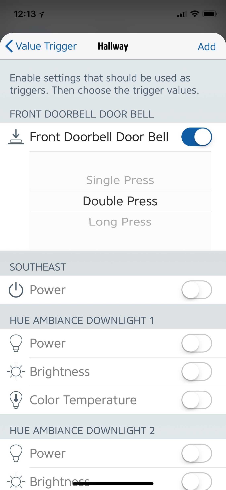
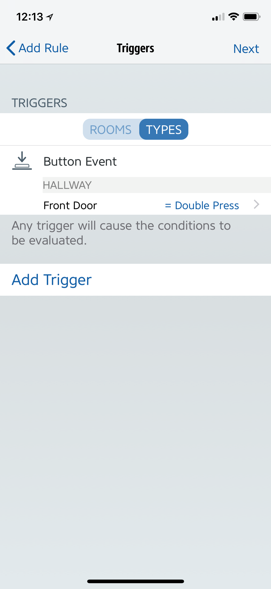
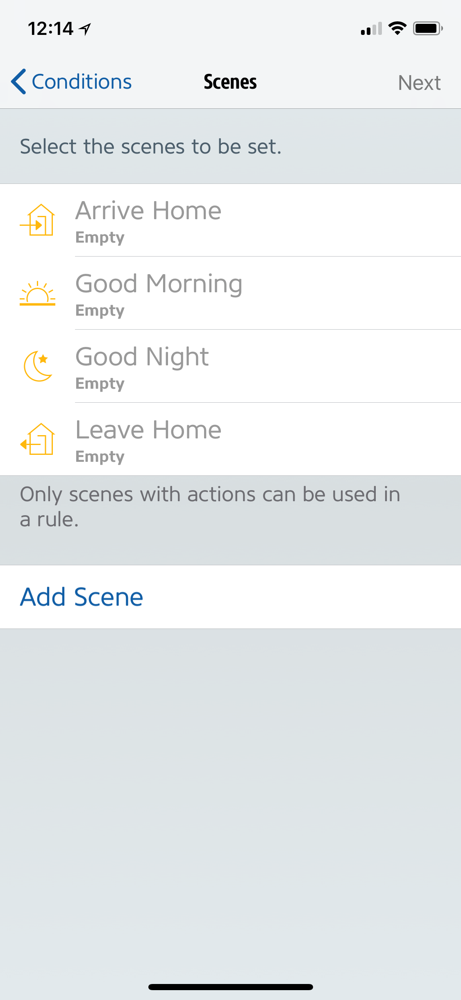

# homebridge-platform-ring-video-doorbell
A [Ring Video Doorbell](https://ring.com/) platform plugin for [Homebridge](https://github.com/nfarina/homebridge).

# Installation
Run these commands:

    % sudo npm install -g homebridge
    % sudo npm install -g homebridge-platform-ring-video-doorbell

On Linux, you might see this output for the second command:

    npm ERR! pcap@2.0.0 install: node-gyp rebuild
    npm ERR! Exit status 1
    npm ERR!

If so, please try

    % apt-get install libpcap-dev

and try

    % sudo npm install -g homebridge-platform-ring-video-doorbell

again!

NB: If you install homebridge like this:

    sudo npm install -g --unsafe-perm homebridge

Then all subsequent installations must be like this:

    sudo npm install -g --unsafe-perm homebridge-platform-ring-video-doorbell

# Configuration
Edit `~/.homebridge/config`, inside `"platforms": [ ... ]` add:

    { "platform"  : "ring-video-doorbell"
    , "name"      : "Doorbell"
    , "username"  : "user@example.com"
    , "password"  : "secret"

    , "options"   : { "retries": 5, "ttl": 5, "verboseP" : false }
    }

The `options` line contains defaults, so you may omit it.

# HomeKit Appearance
Each doorbell appears as an appliance that is both a "programmable switch" and a "motion detector".

For example,
as shown in the [Eve App](https://www.evehome.com/en/eve-app):

## "Motion Detector" Notifications
By using Apple's iOS Home app,
you can enable notifications when motion is detected, e.g.,

Whenever motion is detected,
your reachable iOS devices will receive a notification, e.g.,

## "Programmable Switch" Actions
HomeKit allows you to creates rules that make use of the ringing of a doorbell.

For example,
going from "Scenes" to "Rules" in the Eve App:

You can drill down to adding a "trigger" for the doorbell when it rings:

Optionally, the rule may be tailored to only fire when other "conditions" are met
(e.g., during a certain time of day):

Once those "conditions" are set,
you define a "scene" that tells HomeKit what to do when the "trigger" and "conditions" are met:

# Camera Integration
Possibly soon.

# Many Thanks
Many thanks to [jeroenmoors](https://github.com/jeroenmoors) author of
[php-ring-api](https://github.com/jeroenmoors/php-ring-api).

Many thanks (also) to [davglass](https://github.com/davglass) author of
[doorbot](https://github.com/davglass/doorbot).
